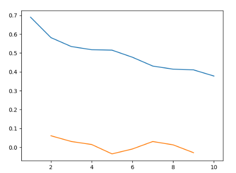
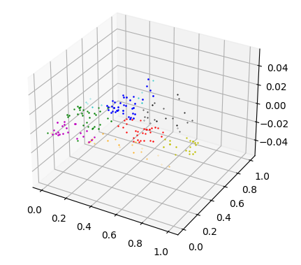
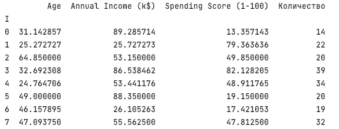

# Clustering 
###K-means Algorithms

I took a dataset of customers, where their gender, age, 
how much they receive and how much they spend are indicated:
[dataset](Mall_Customers.csv)

Investigated 3 characteristic (Age, Annual Income (k$), Spending Score (1-100))

Graph obtained using the elbow method, chose 8 clusters:

I find centroids and assign each point to the nearest cluster using the method k-means:
[outputFile](points.csv)

3d representation of clusters:

In this file there is a dataset with the addition of a cluster number column:
[file](data_clust.csv)

Information on clusters, averages and the number of points in it:
