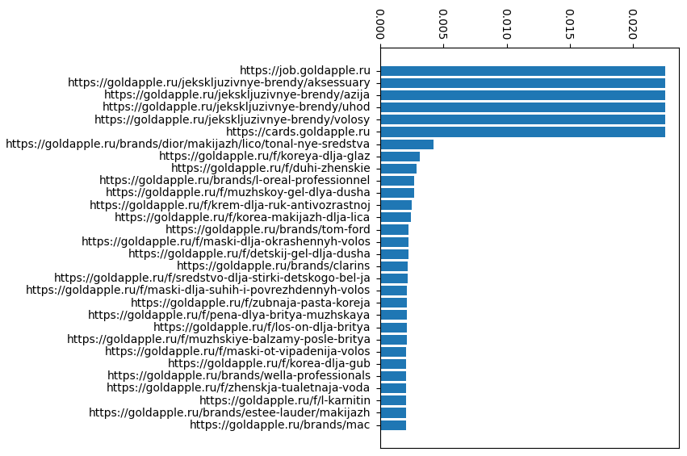

# Page Rank

### 1. [Collect all links from a website depth 3](parse.py)
#### [screen of db depth 1](url_refer_db1.png)
#### [screen of db depth 3](url_refer_db2.png)

### 2. [Create transition matrix based on link references and page rank vector](rank.py)
#### [screen of db page rank](page_rank_db.png)

### 3. [Create diagram of the first 30 big ranks](diagr.py)
